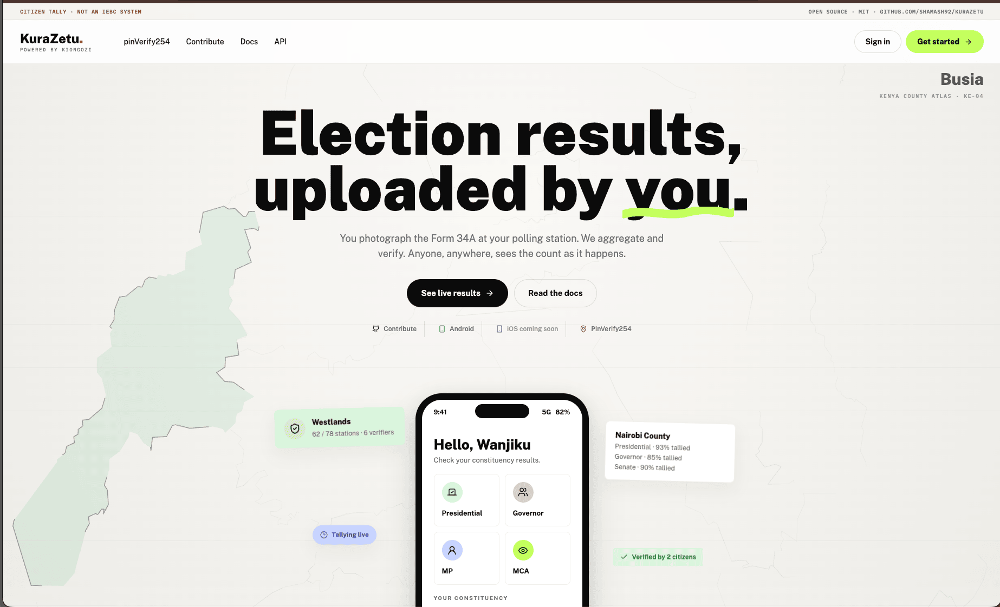
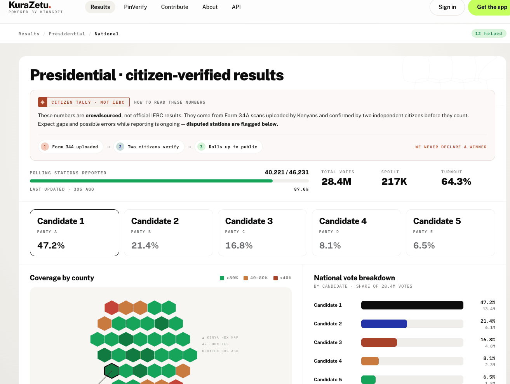
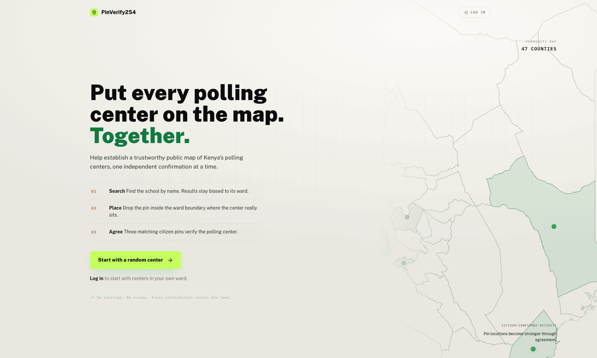
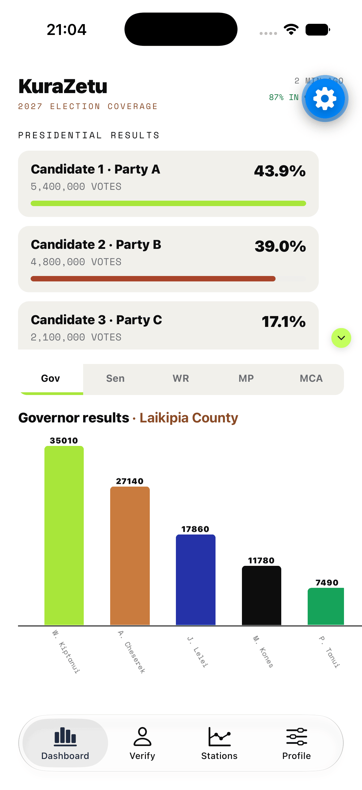
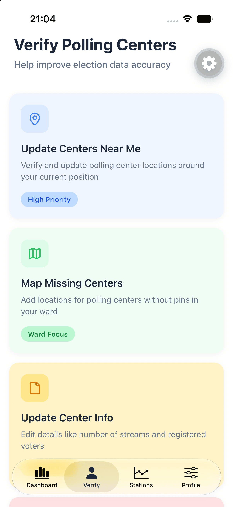

# Kura Zetu

**Kura Zetu** (https://kurazetu.com)is an open source platform with mobile application built by and for Kenyans to enable communities to track, verify, and tally election results at the polling station level.

Since every Kenyan voter has access to a smartphone and results announced at polling stations are legally final, citizens can serve as agents of electoral transparency. The platform implements crowd-sourced uploads, real-time tallies, and a community verification system that allows everyday citizens, developers, journalists, civil society organizations, and oversight bodies to participate in safeguarding electoral integrity from the ground up.

The system is designed as an open source, community-driven project where anyone can contribute, verify, and improve the codebase.

  

> [!CAUTION]
> This project is not an official tallying system. It does not provide legal representation of election results and does not replace Independent Electoral and Boundaries Commission (IEBC) systems. This is a parallel citizen-led tool for transparency, verification, and civic vigilance. It may contain inaccuracies and gaps and should not be used as a sole source for official election results.

## Why Kura Zetu?

Kenya conducts elections in over 46,000 polling stations. Each station posts Form 34A results that carry legal weight, but verifying these results at scale (and self-tallying) remains challenging for citizens.

Kura Zetu addresses this challenge by:

- Crowdsourcing results from individual polling stations
- Enabling public cross-verification of vote counts and irregularity flagging
- Providing live, transparent tally dashboards
- Implementing a community notes system for flagging suspected fraud, misinformation, or conflicting results

## What It Looks Like

Every number below is **sample data**. We never declare a winner.

**Live tally, with the caveats attached.** Every figure traces back to a Form 34A scan confirmed by two independent citizens.

  

**PinVerify254 — mapping the ground truth.** Kenya's polling centers are not all on a map. Three matching citizen pins verify a location.

  

**On the phone, where the uploads happen.**

<table>
  <tr>
    <td align="center"></td>
    <td align="center"></td>
  </tr>
  <tr>
    <td align="center"><b>Results dashboard</b></td>
    <td align="center"><b>Verify polling centers</b></td>
  </tr>
</table>

## Why We Have AGENTS.md and CLAUDE.md

We used **no AI agents on this project until June 2026**. That was deliberate, and at the time it was the right call.

Things have matured. The ecosystem has moved, and so has the work — we see it in our day jobs and in teams across the world. This is a project of serious scope carried mostly by a single developer, and we intend to support every contributor who shows up, with whatever tools they bring.

> *Meet contributors where they are.*

So we accepted AI, **on our terms**. [`AGENTS.md`](./AGENTS.md) and the various `CLAUDE.md` files are those terms.

They are **guardrails**, not tutorials. They encode the standard of technical quality we hold to, and they are unapologetically opinionated: how you contribute, how commits and branches are shaped, how we envision the architecture and where we expect it to grow. An agent that reads them produces work that looks like ours. One that ignores them produces work we send back.

They are worth reading if you are human, too. They are the shortest honest description of our taste that we have written down — and we hope you take something from working here, long after this project.

## Project Scope

This project is:

[x] A citizen-driven platform for transparency and accountability

[x] An open-source collaborative system

[x]  A civic empowerment tool with no political affiliation

[x]  A platform for education, participation, and digital oversight

This project is not:

- A system for legally challenging election results
- A means to announce or declare election results
- An official government or IEBC system replacement
- A substitute for legal electoral processes
- A partisan or politically-affiliated project
- A guaranteed source of unverified accurate results
- A tool for harassment, violence promotion, or intimidation
- A platform for misinformation, disinformation, or hate speech distribution
- A replacement for responsible journalism or civic engagement
- A tool for personal gain or political manipulation

## Contributors Needed

This project requires diverse expertise beyond software development:

**Technical Contributors:**

- Backend and Frontend Developers (Django, React)
- DevOps Engineers (CI/CD, Docker, GitHub Actions)
- Security Experts (software verification, data integrity)

**Non-Technical Contributors:**

- Legal Professionals (electoral law, privacy, rights)
- UX/UI Designers (accessibility, community input)
- Media and Influencers (messaging, usage guidance)
- NGOs and Civil Society (oversight, community engagement)
- Community Organizers (local mobilization and awareness)

## Documentation

Complete setup instructions, contribution guidelines, and local build documentation:

**[Read the Documentation](https://kurazetu.readthedocs.io)**
**[Report Issues](https://github.com/shamash92/KuraZetu/issues/new?title=docs%3A+TYPE+YOUR+QUESTION+HERE&body=*Please%20describe%20the%20question%20or%20issue%20you%27re%20facing%20with%20%22Community%20Tally%20documentation%22.*%0A%0A%0A%0A%0A---%0A*Reported+from%3A+https://kurazetu.readthedocs.io/)**

## Getting Started

See the [setup guide](https://kurazetu.readthedocs.io/tutorials/setup) for detailed development environment configuration.
