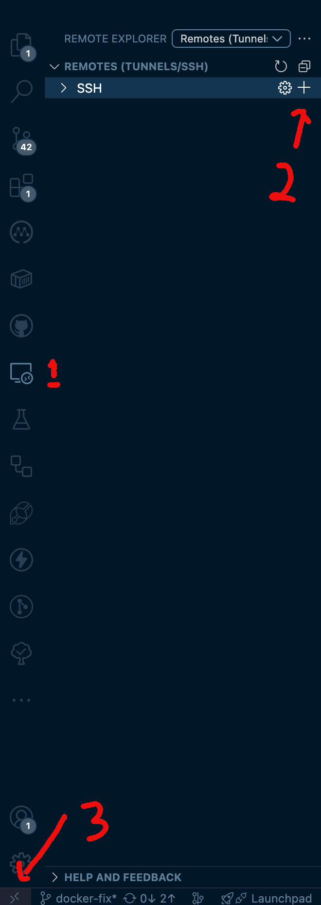

# How to connect to a Multipass instance with VS Code

This guide will help you set up a Multipass instance and connect to it using Visual Studio Code (VS Code) with the [Remote - SSH extension](https://marketplace.visualstudio.com/items?itemName=ms-vscode-remote.remote-ssh).

## Create SSH keys

If you already have an SSH key you would like to use for this machine, skip this step. Otherwise, you will need to generate a key in order to authenticate your host machine as it accesses the remote development environment.

To generate a new key pair, run this command:

```bash
ssh-keygen -t rsa
```

This will prompt you to enter a file name (e.g `kurazetu_key`) and passphrase (optional).

```{tip}
You can press Enter to accept the default file name and leave the passphrase empty for no passphrase.
```

``` {terminal}

Generating public/private rsa key pair.
Enter file in which to save the key (/Users/shamash/.ssh/id_rsa): kurazetu_key
Enter passphrase for "kurazetu_key" (empty for no passphrase): 
Enter same passphrase again: 
Your identification has been saved in kurazetu_key
Your public key has been saved in kurazetu_key.pub
The key fingerprint is:
SHA256:ivX6ESsNNNXUMmyHN/RJ+a8KQDhF75FvtGFCghcBKRE shamash@Shamash.local
The key's randomart image is:
+---[RSA 3072]----+
|    Eo.=B*o+. .. |
|    . o+.+B.=o.. |
|     .=...==+.o. |
|     . + . * o  .|
|      o S . +   .|
|     o = + .    .|
|    . o = .    . |
|       o . .  .  |
|      ...   ..   |
+----[SHA256]-----+
```

## Create a cloud-init configuration file

Rename the `sample.vscode.yaml` file to `vscode.yaml`. This file will be used to configure the Multipass instance during its creation.

```bash
cp sample.vscode.yaml vscode.yaml
```

```yaml
groups:
  - vscode
runcmd:
  - adduser ubuntu vscode
ssh_authorized_keys:
  - <public key>
```

Replace `<public key>` with the contents of your public key file (e.g., `kurazetu_key.pub`).

```{tip}
You can copy the contents of your public key file using the `cat` command:
```

```bash
cat kurazetu_key.pub
```

## Create a Multipass instance

To create a new Multipass instance with the `cloud-init` configuration, run the following command:

```bash
multipass launch noble --name kurazetu-vm --cpus 2 --disk 20G --memory 4G --cloud-init vscode.yaml
```

Note: `noble` is the name of the Ubuntu release you want to use, in this case Ubuntu 24.04. You can replace it with any other supported Ubuntu release (e.g., `focal`, `jammy`, etc.).

For customizing the instance, you can specify additional parameters such as CPU, memory, and disk size.
> See more: [How to customize Multipass instances](./customize-multipass.md)

## Connect to the Multipass instance with VS Code

To connect to your Multipass instance using VS Code, follow these steps:

1. Open VS Code.
2. SSH into the VM via terminal
   - Open a terminal in VS Code (or use your system terminal).
   - Run the following command to connect to your Multipass instance:

    ```{important} Important step
    This will prompt you to accept the host fingerprint if it's the first time connecting to this instance. Type `yes` to continue.
    ```

    ```bash
    ssh -i kurazetu_key ubuntu@your-vm-ip
    ```

    ```{terminal}
        The authenticity of host '192.168.xx.xx (192.168.xx.xx)' can't be established.
        ED25519 key fingerprint is SHA256:NI/KOZQIFQyhdLSV41amPy+xvmmjggwuMf2eK0Z2qSg.
        This key is not known by any other names.
        Are you sure you want to continue connecting (yes/no/[fingerprint])? yes
        Warning: Permanently added '192.168.xx.xx' (ED25519) to the list of known hosts.
        Welcome to Ubuntu 24.04.2 LTS (GNU/Linux 6.8.0-60-generic aarch64)

        * Documentation:  https://help.ubuntu.com
        * Management:     https://landscape.canonical.com
        * Support:        https://ubuntu.com/pro


        System load:             0.08
        Usage of /:              10.3% of 18.33GB
        Memory usage:            4%
        Swap usage:              0%
        Processes:               109
        Users logged in:         1
        IPv4 address for enp0s1: 192.168.xx.xx

        To run a command as administrator (user "root"), use "sudo <command>".
        See "man sudo_root" for details.

        ubuntu@kurazetu-vm:~$ code .
    ```

    - You can find this IP address by running `multipass list` in your terminal, or by looking at the instance details in the Multipass GUI. You can also get it by running the command `multipass info kurazetu-vm` in your terminal.

    - This adds the host fingerprint to your ~/.ssh/known_hosts file.

3. Install the **Remote - SSH** extension if you haven't already.

   - 

4. Now edit the config file (the gear icon on the left hand side of number 2 in image above) using `vscode` to add the SSH key and host information for easier access in the future

    ```yaml
        Host <your-vm-ip>
        HostName <your-vm-ip>
        User ubuntu
        IdentityFile < your full provate key path e.g. /Users/shamash/xxx/KuraZetu/kurazetu_key>
    ```

5. There are a few ways to connect to the Multipass instance:

   - Navigate to the **Remote Explorer** view in the sidebar. If you have done the configuration in step 4, you should see your Multipass instance listed there.

   - Click on the "+" icon (number 2 on the image below) to add a new SSH target.
  
   - Enter the SSH connection string in the format `ssh ubuntu@<your-vm-ip>`, where `<your-vm-ip>` is the IP address of your Multipass instance. You can find this IP address by running `multipass list` in your terminal, or by looking at the instance details in the Multipass GUI. You can also get it by running the command `multipass info kurazetu-vm` in your terminal.
   -
  