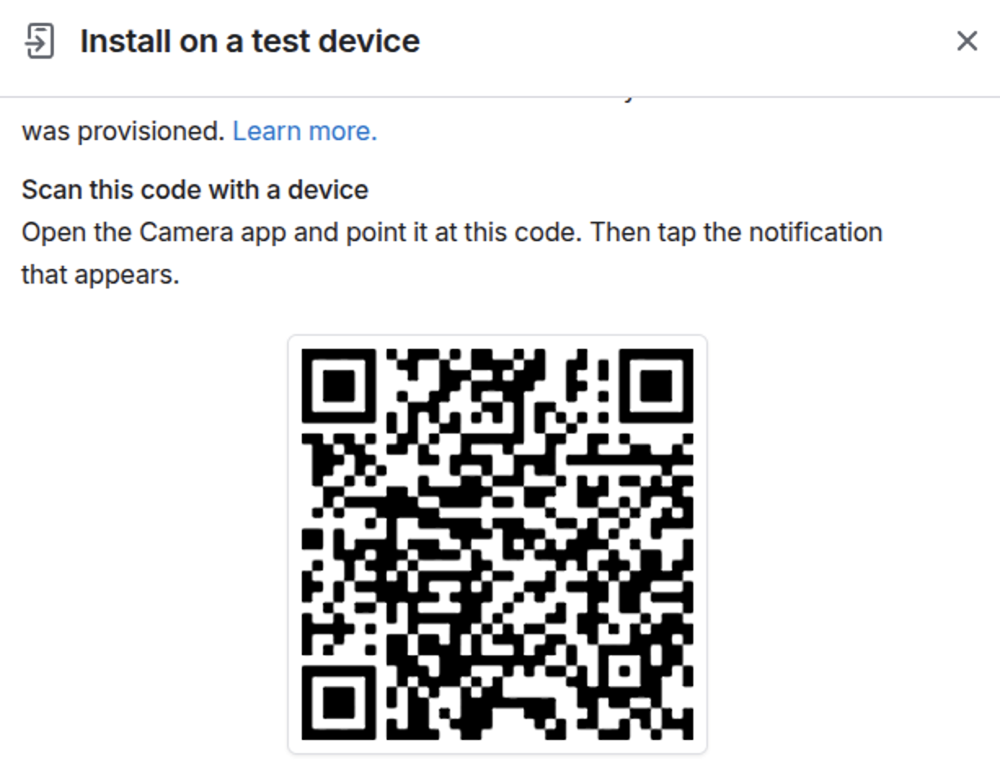

# Setting Up the Expo project in the `NATIVE/` folder

Follow this tutorial to set up and run the Expo project located in the `NATIVE/` folder. Choose your preferred method using the tabs below.

## Prerequisite

Make sure you have **Node.js v20 or higher** installed. You can check your version with:

```bash
 node --version
```

## 1. Initial Setup

Inside the `NATIVE/` directory, copy the `.env.sample` file to `.env` and fill in the required values.
The value for `EXPO_PUBLIC_DEVELOPMENT_IP_ADDRESS` is the computer local IP address (e.g., `192.168.XX.X`). Also make sure to add this IP address to the `src/.env` file as part of the `ALLOWED_HOSTS` variable.

To obtain this, run the following command in your terminal:

````{tabs}
```{group-tab} MacOS
- run the following command in your terminal:
    ```bash
    ipconfig getifaddr en0
    ```
```

```{group-tab} Windows
- run the following command in your terminal:

    ```shell
    ipconfig
    ```
```

```{group-tab} Linux (Ubuntu)
- run the following command in your terminal:

    ```bash
    hostname -I
    ```
```

````

For now, you can leave `EXPO_PUBLIC_PRODUCTION_BASE_URL` empty. This will be set up later when we deploy the app.

```bash
cd NATIVE/
yarn install
```

## 2. Running the App

````{tabs}

```{group-tab} Android Studio Emulator

1. Install Android Studio
    Download and install [Android Studio](https://developer.android.com/studio).

2. Set Up an Emulator
    - Open Android Studio.
    - Go to Device Manager.
    - Create and start a new virtual device.

3. Start the Expo Project

    ```bash
    npx expo start -c
    ```

    - Press `a` in the Expo CLI to launch the app on the emulator.
```

```{group-tab} Expo Go

1. **Install Expo Go**
    Download Expo Go from [Google Play Store](https://play.google.com/store/apps/details?id=host.exp.exponent).

2. **Start the Expo Project**

    ```bash
    npx expo start -c
    ```

    - Scan the QR code with Expo Go to open the app.
```

```{group-tab} Expo Development Builds (Recommended)

1. Before you  start:
    ``` {important}
    **Why use a Development Build?**
    The only way to test features like push notifications, live location, proper splash screen behavior, and near end-product performance is through a development build. Expo Go does not support these native features, so using a development build is essential for full-feature testing and realistic app behavior.
    ```

2.  **Note:**
You do **not** need to manually install the development build APK on an emulator or simulator. If you are using an Android emulator (via Android Studio), simply run:

    ```bash
    npx expo prebuild --clean --platform=android
    npx expo run:android
    ```

This command will automatically build and install the development build onto your emulator or any connected device.

Otherwise, if you are using a physical device, you can download the APK from the  link below or scan the QR code to install the development build:

- [Download the APK](https://expo.dev/accounts/shamash92/projects/community-tally/builds/29597eff-c59b-4eae-81e6-f87ecc92c6d5)

- Scan the QR code below to install the development build on your device:



The prebuilt development build APK and QR code are intended for installing the app directly on **physical Android devices**. Use this option if you want to test on your phone or tablet without building locally.

3. **Start the Expo Project**

    ```bash
    npx expo run:android
    ```
- NOTE: This may take a while to finish the first time (especially if Android SDK Platform will be installed and depending on your internet speed). However, consecutive runs will be faster.

- Open the app and connect to your local android device/simulator.

```
````

## 3. Note about local Django backend

The app is set up to connect to a local Django backend server. To run the backend server, follow the instructions in the [Backend Setup](./setup.md) tutorial. Make sure to set the `EXPO_PUBLIC_DEVELOPMENT_IP_ADDRESS` in the `.env` file to your local IP address (e.g., `192.168.XX.X`) and add this IP address to the `ALLOWED_HOSTS` variable in the `src/.env` file.

## Troubleshooting

(Mac Users) if you encounter this error when running `npx expo run:android`:

```{terminal}

A problem occurred evaluating root project 'community-tally'.
> Failed to apply plugin 'com.facebook.react.rootproject'.
   > A problem occurred configuring project ':app'.
      > SDK location not found. Define a valid SDK location with an ANDROID_HOME environment variable or by setting the sdk.dir path in your project's local properties file at '/Users/'your-user-name'/Documents/code/Community-Tally/NATIVE/android/local.properties'.
```

Then create a `local.properties` file in the `android` folder with the following command:

```bash
echo "sdk.dir=$HOME/Library/Android/sdk" > "$(pwd)/android/local.properties"
```
